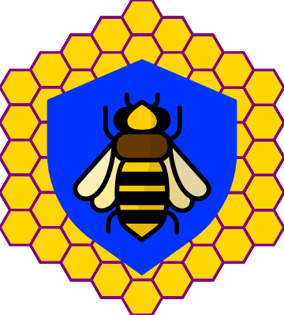

  
  <h1 style="font-size: 3em; font-weight: 100; font-family: 'Nunito', sans-serif; margin: 0; text-decoration: none;">Beekeeper</h1>

<!--  -->

## Overview

Beekeeper is an open-source Authentication, Authorization, and User Management system. It supports both third-party and custom OAuth2.0 and OpenID Connect (OpenIDC) implementations. Built with Rust, it leverages the hexagonal architecture to allow easy swapping of adaptors, databases, and input methods.

## Features

- **Security**: Utilizes Argon2 for password hashing and Paseto for token management.
- **Flexible Architecture**: Hexagonal architecture for easy integration and adaptability.

### Features to be Implemented

#### Databases
- [x] In-Memory database support
- [ ] SQLite database support
- [ ] MongoDB database support
- [ ] DynamoDB database support
- [ ] PostgreSQL database support

#### Domain
- [ ] Third-party OAuth2.0 and OpenID Connect integration
- [ ] Own OAuth2.0 and OpenID Connect implementation
- [ ] Email validation
- [ ] Logging

#### Interface
- [x] HTTP API with Actix
- [ ] GRPC input method
- [ ] Lambda input method
- [ ] YAML configuration support
- [ ] JSON configuration support

## Contributing

Contributions are welcome! Please read the [contributing guidelines](CONTRIBUTING.md) first.

## License

This project is licensed under the MIT License - see the [LICENSE](LICENSE) file for details.

## Contact

For questions or suggestions, please open an issue or contact the maintainers.

---

*Note: Ensure the badge URLs point to the correct paths for your repository.*
